# PASSWORD CRACKING WITH JTR & NETWORK TOOLS

Building an authorized password recovery and security assessment framework combining offline hash extraction via John the Ripper and browser-based dictionary attacks via Networkwalks utilities.

  
  

  
  

  
  

  
  

---

## 📋 Table of Contents
* [Tools & Technologies](#-tools--technologies)
* [Methodology & Execution](#-methodology--execution)
  * [Method 1: Password Cracking with John the Ripper & Johnny GUI](#method-1-password-cracking-with-john-the-ripper--johnny-gui)
  * [Method 2: Password Cracking with Networkwalks Tools](#method-2-password-cracking-with-networkwalks-tools)
* [Key Security Concepts & Takeaways](#-key-security-concepts--takeaways)
* [References](#-references)

---

## 🧰 Tools & Technologies

| Tool / Technology | Category | Description |
| :--- | :--- | :--- |
| **John the Ripper (JTR)** | Password Cracker | Open-source multi-format password recovery tool supporting various hashes. |
| **Johnny GUI** | Graphical Interface | Graphical point-and-click interface wrapper for John the Ripper. |
| **Networkwalks Hash Calculator** | Web Utility | Browser-based utility used to extract crackable `$pdf$` format hashes. |
| **Networkwalks Password Cracker** | Web Cracker | Online dictionary attack tool for evaluating credential strengths. |

---

## ⚙️ Methodology & Execution

### Method 1: Password Cracking with John the Ripper & Johnny GUI (Applied to Multiple Locked PDFs)

* **JTR & Johnny Download:** Downloaded John the Ripper and the Johnny GUI setup package (`johnny-2.2-win.zip`) from the official Openwall website, mirror links, or the course Google Drive folder.
  
  * 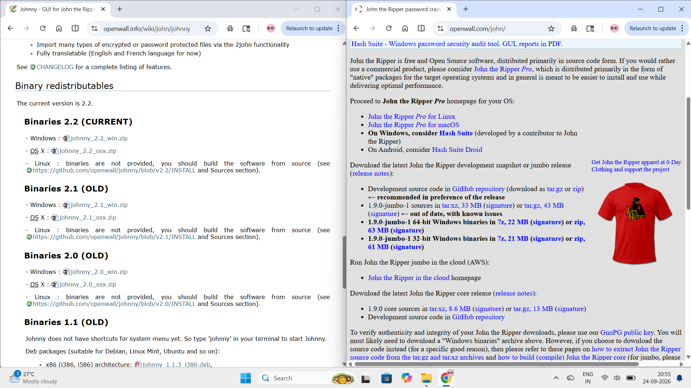
* **Application Installation:** Located and ran the Johnny installer setup file (`johnny-installer.exe`) from the `Downloads` folder to install Johnny on the Windows PC.
  
  * 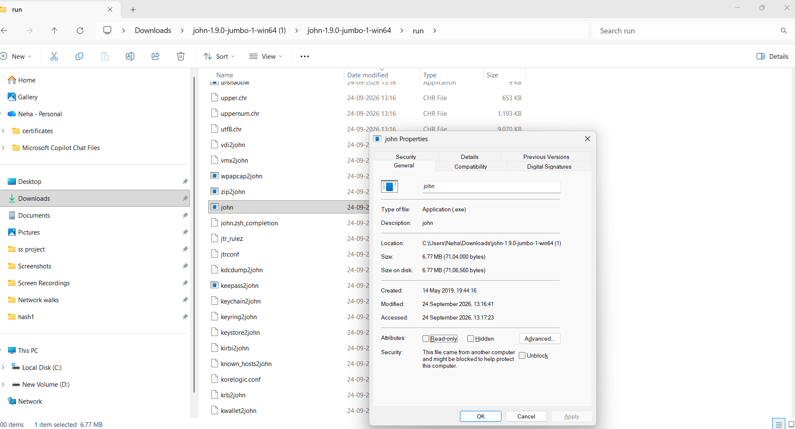
* **Binary Path Configuration:** Configured Johnny by navigating to `Settings` and mapping the executable path to `john.exe` inside the JTR run folder.
  
  * 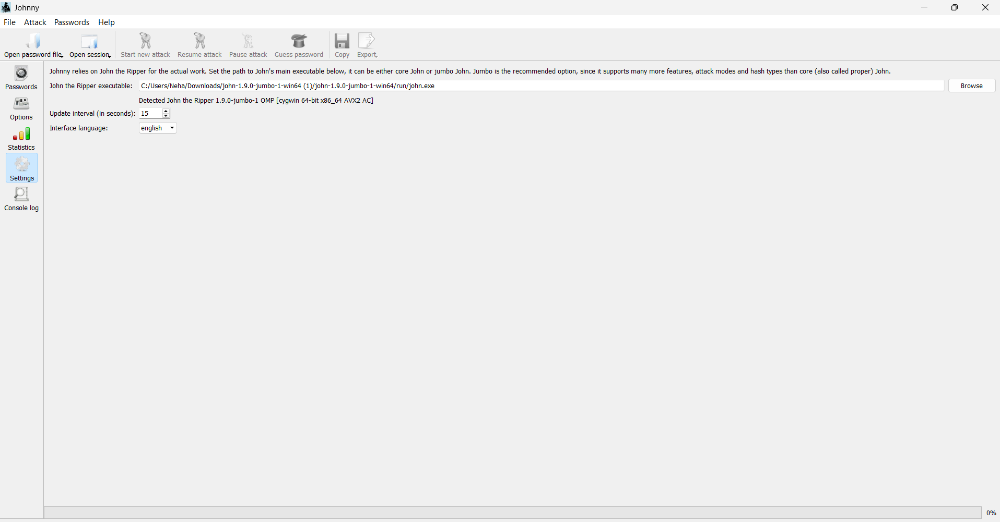
* **PDF Hash Extraction:** Uploaded each of the locked PDF files (`My Locked PDF1.pdf`, `My Locked PDF2.pdf`, and `My Locked PDF3.pdf`) sequentially to an online PDF hash extractor to obtain their respective string values starting with `$pdf$`.
  
  * 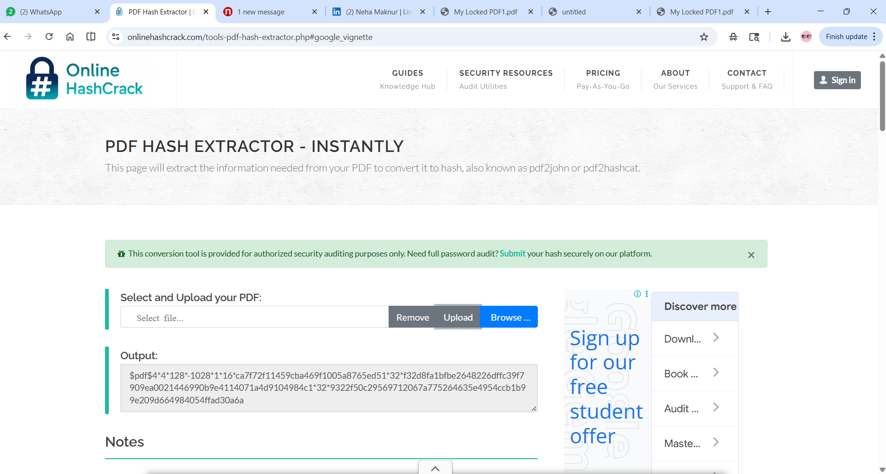
  * Extracted the individual hash values for `My Locked PDF1.pdf`, `My Locked PDF2.pdf`, and `My Locked PDF3.pdf` using the online PDF hash extractor.
* **Hash File Preparation:** Pasted each extracted hash into Notepad, ensured no extra leading characters remained, and saved them respectively as `hash1.txt`, `hash2.txt`, and `hash3.txt`.
* **Attack Initialization:** Opened Johnny, selected `Open password file` to load each hash text file sequentially (`hash1.txt`, `hash2.txt`, and `hash3.txt`), and initiated the process using `Start new attack`.
  
  * 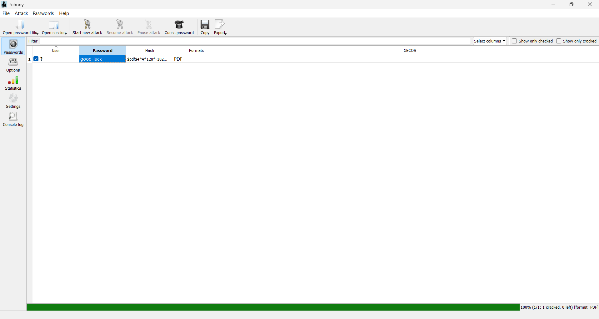
  * 
  * 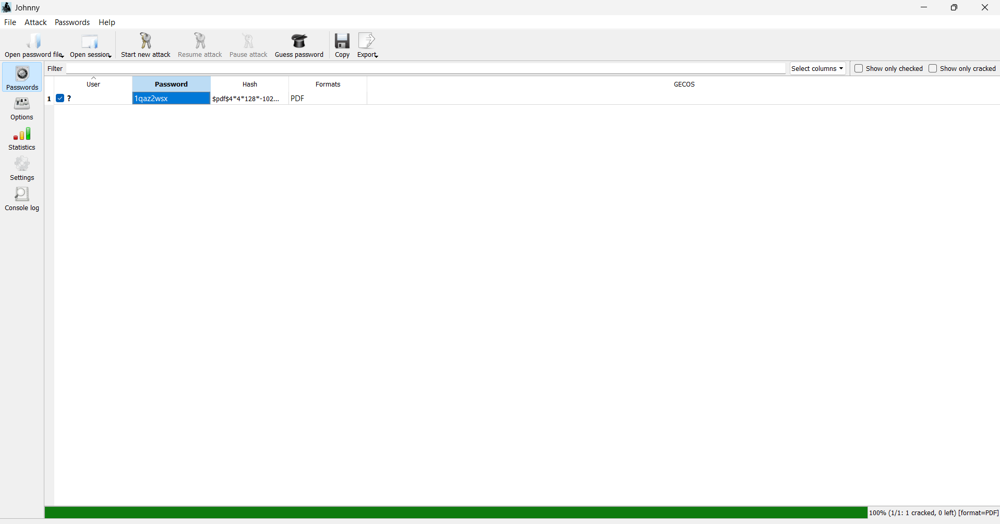

### Method 2: Password Cracking with Networkwalks Tools (Applied to Multiple Locked PDFs)

* **Hash Calculator Access:** Opened the browser-based Networkwalks Hash Calculator utility.
  
  * 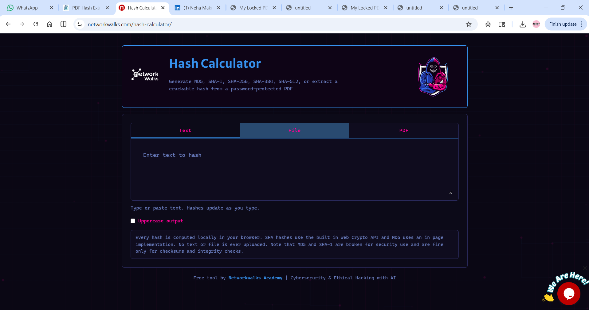
* **File Upload & Parsing:** Uploaded each of the target locked PDF files (`My Locked PDF1.pdf`, `My Locked PDF2.pdf`, and `My Locked PDF3.pdf`) to the Hash Calculator one by one to automatically parse and generate their crackable hash formats.
  
  * 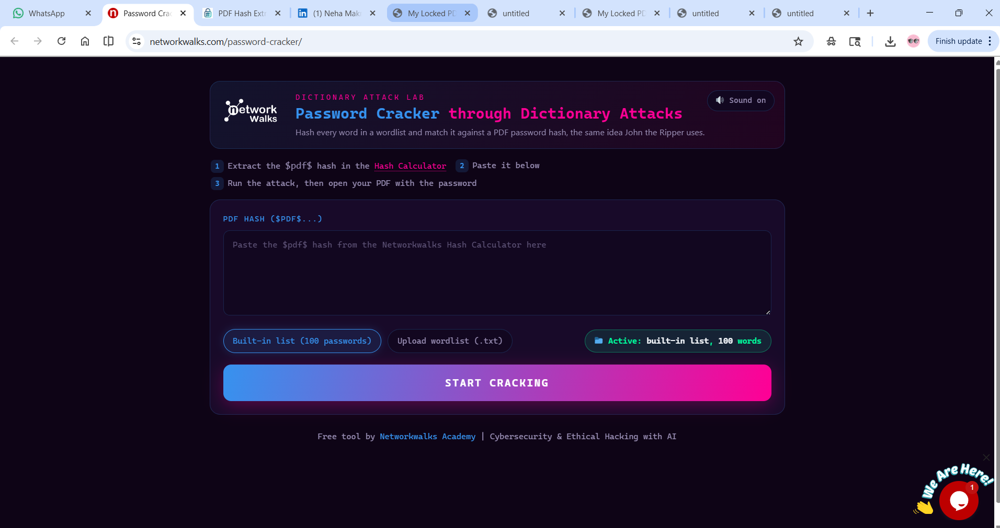
  * Extracted the individual hash values for `My Locked PDF1.pdf`, `My Locked PDF2.pdf`, and `My Locked PDF3.pdf` using the Hash Calculator.
* **Hash String Retrieval:** Copied the complete hash strings beginning with `$pdf$` for each of the respective PDF documents (`My Locked PDF1.pdf`, `My Locked PDF2.pdf`, and `My Locked PDF3.pdf`).
* **Dictionary Attack Execution:** Navigated to the Networkwalks Password Cracker, pasted the extracted hashes for each file sequentially, activated the built-in dictionary list, and selected `Start Cracking`.
  
  * 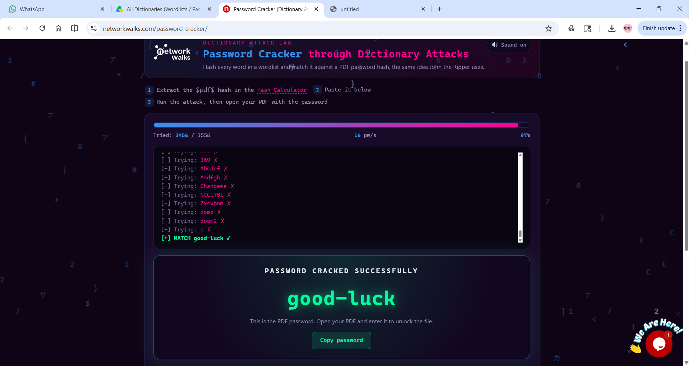
  * 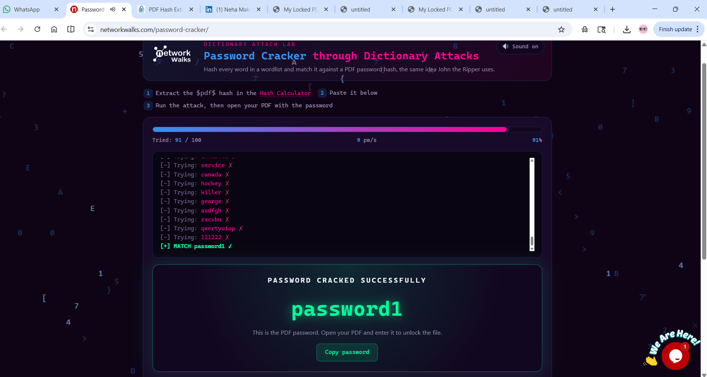
  * 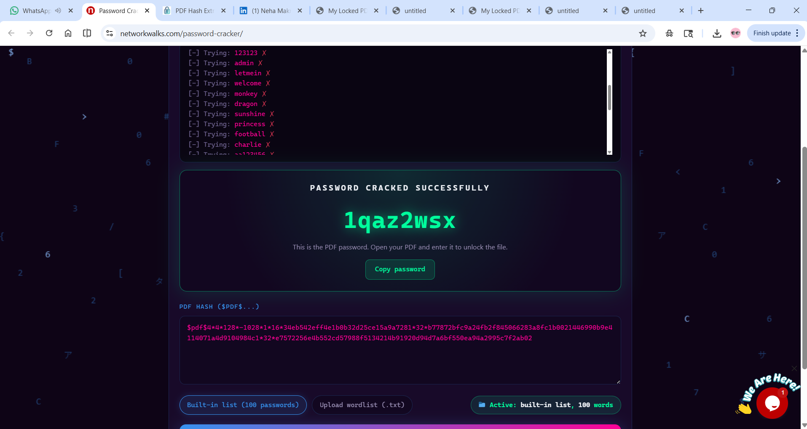

### Common Step: Document Unlocking (Applicable to Both Methods)

* **Document Unlocking:** Extracted and copied the matched cleartext passwords (`password1`, `password2`, and `password3`) from the screen display for all three files, then entered them into the PDF reader to successfully open and view all the protected PDF documents.
  
  * 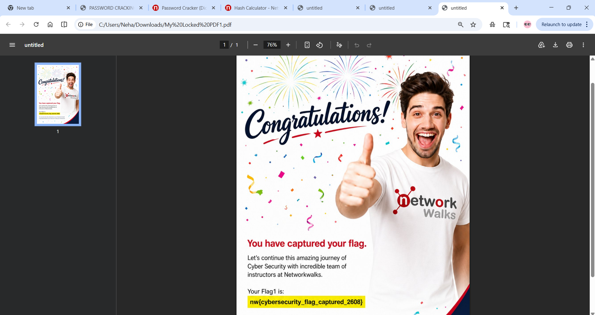
  * 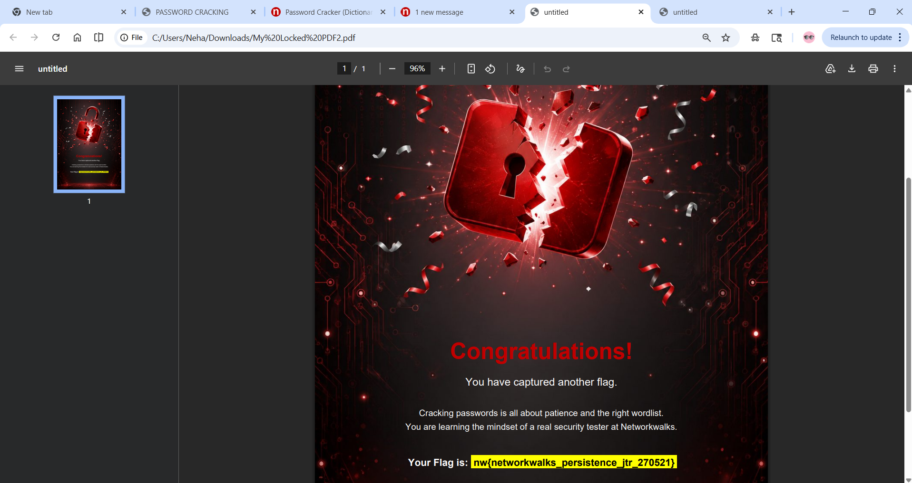
  * 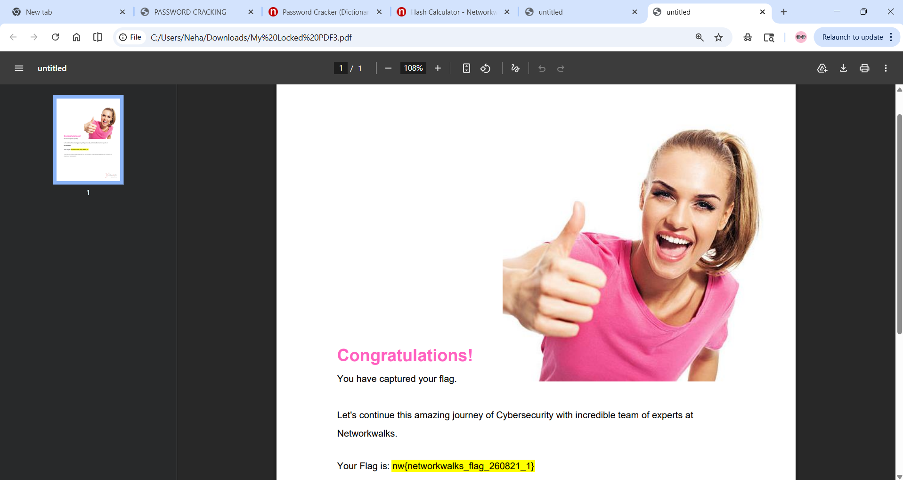

### ⚠️ Problems Faced & Troubleshooting

* **Initial Access Denied Error:** During Method 2, the first target file (`My Locked PDF1.pdf`) triggered an `ACCESS DENIED` and an "Exhausted wordlist. No match" status.
* **Wordlist Limitation:** The default built-in wordlist was insufficient because it did not contain a large enough key space or the correct password variant required to unlock the file.
* **Custom Wordlist Resolution:** Resolved the issue by uploading an external, comprehensive wordlist containing over 3,000 words via the custom wordlist option, which successfully enabled the tool to locate and recover the password.

### 💡 Lessons Learned

* **Impact of Wordlist Selection:** The success of a dictionary-based password cracking attack relies heavily on the quality, relevance, and size of the wordlist used.
* **Limitations of Default Dictionaries:** Built-in default wordlists on web tools often contain restricted entries, making them insufficient for files protected by stronger or less common passwords.
* **Value of Custom Wordlists:** Utilizing comprehensive external wordlists significantly increases the likelihood of successfully recovering passwords when initial automated attempts fail due to exhausted dictionaries.
* **Tool Flexibility:** Having the ability to upload custom text-based wordlists is a crucial feature for bypassing restrictions and handling diverse security challenges in penetration testing and recovery tasks.

### 📌 Key Security Concepts & Takeaways

* **Encryption vs. Hashing:** Encryption is a two-way reversible function for data protection, whereas hashing is a one-way mathematical function used for verification.
* **Password Vulnerability:** Short or common patterns (such as dictionary words or simple character strings) can be compromised in minutes via automated dictionary attacks.

## 🔗 Resources
* GitHub Repository: [github.com/ketankamblee/-Password-Cracking](https://github.com/ketankamblee/-Password-Cracking)
* Networkwalks Training Academy: [www.networkwalks.com](https://www.networkwalks.com)[cite: 6]
